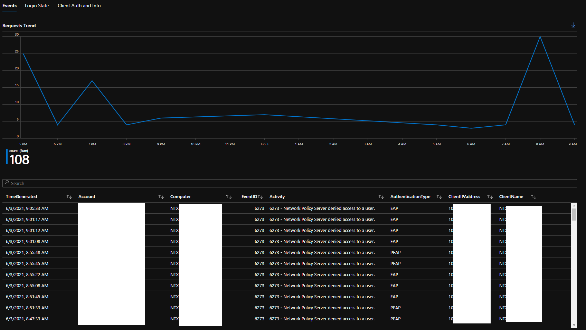
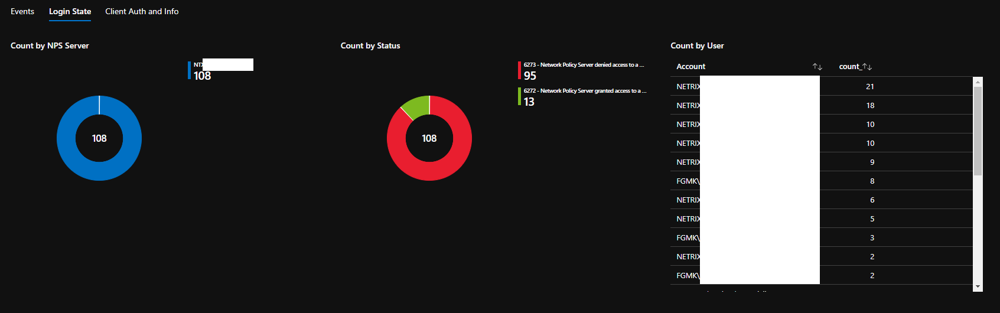
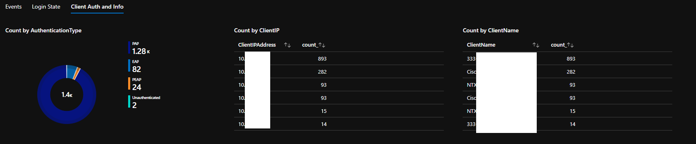

# Azure monitor Workbook to visualize Windows Server NPS/RADIUS for Azure Sentinel
author: Rich Lilly

This workbook will take existing evnet logs for NPS authentication auditing and showcase the data in a workbook.
It is first required to enable Common SecurityEvent logging and follow the directions in the paired parser to enable logging

## Prerequisites
1. Onboard Windows Servers and enable "Common" SecurityEvent logging
2. Import Parser

## Workbooks - how to Import and Export:

This is repeated in a file (open the instructions file in *RAW* mode and download to see the screenshots), see instructions in the workbooks folder:

### Installation Instructions:
 
1. Select the [RAW] button, [Copy] the workbook file content (these are JSON files),  open Azure Monitor Workbooks (from portal.azure.com) - open the “empty” Azure Monitor Workbook, in “advanced edit” mode (press the </> icon ).  Please [paste] over any json that exists.   
2. Then Press [apply] then [Done Editing]

### Export:
Open Azure Monitor Workbooks
1. In “advanced edit” mode (press the </> icon) - Choose "Gallery Template" for JSON file or ARM, then press the blue arrow (to the left of the [Apply] button) to download the file

Events: 

Login State:  

Client Auth and Info: 
